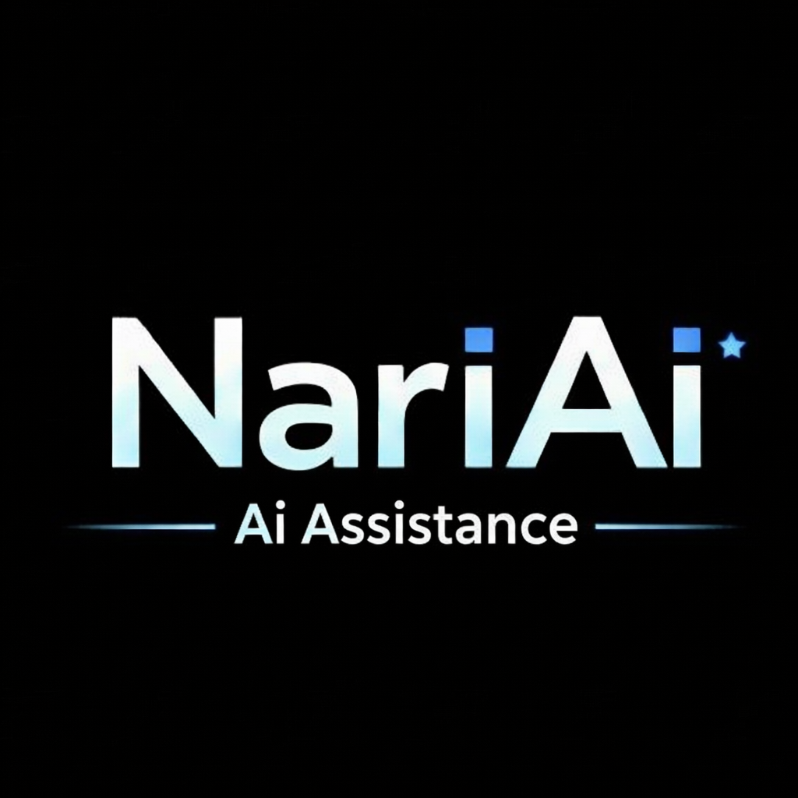

# Narihito AI Assistant



A Telegram bot that acts as Narihito's personal AI assistant — chats, listens to voice notes, reads images/files, generates images and voice replies, and searches the web, all through real tool calling.

## Features

- Natural conversation with per-user chat history (MongoDB)
- Voice message transcription and spoken voice replies
- Image analysis and image generation
- File reading (text, PDF, DOCX) and file creation (text, code, csv, json, etc.)
- Web search, scrape, crawl, and site mapping
- YouTube search and transcript lookup
- Polls, reminders, and location sharing in Telegram

## Stack

| Purpose | Provider |
|---|---|
| Text chat + tool calling | [xkiro](https://xkiro.com) (OpenAI-compatible), with automatic fallback across free models |
| Voice transcription & TTS | Groq |
| Image analysis | Gemini |
| Image generation | UnoRouter |
| Web search / scrape / crawl | Firecrawl |
| Database | MongoDB (chat history, sessions) + Supabase Storage (audio files) |
| Bot transport | Telegram Bot API |
| Hosting | Vercel serverless functions |

## Project Structure

```
├── api/
│   └── index.js            # Vercel serverless entry point (webhook handler)
└── src/
    ├── controllers/         # Telegram message handling logic
    ├── services/            # External provider clients (xkiro, groq, gemini, uno, firecrawl, mongo, supabase, bot)
    ├── models/               # Mongoose schemas
    ├── prompts/             # System prompts
    ├── tools/                # Tool-calling schemas for the AI
    └── utils/                # Shared helpers
```

## Setup

1. Install dependencies:
   ```
   npm install
   ```
2. Copy `.env.example` to `.env` and fill in the required keys:
   - `TOKEN` — Telegram bot token
   - `AI` — Groq API key
   - `XKIRO` — xkiro API key
   - `URI` — MongoDB connection string
   - `SUPAURL` / `SUPAKEY` — Supabase project URL/key
   - `GEMINI` — Gemini API key
   - `UNO` — UnoRouter API key
   - `FIRECRAWL` — Firecrawl API key
   - `CHATID` — Narihito's Telegram user ID
3. Deploy to Vercel, or run locally with a Telegram webhook pointed at your dev tunnel.

## License

Personal project — not licensed for reuse.
